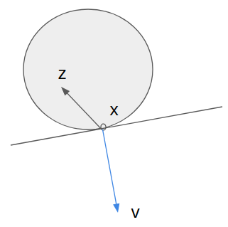
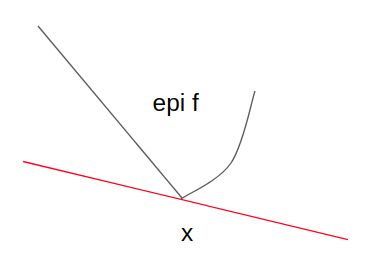

## Convex sets

A set $S$ is convex if and only if, for any two points $x, y \in S$:
$$ \lambda x + (1-\lambda) y \in S \,\, \forall \lambda \in [0, 1] $$

**Supporting hyperplane theorem**
The *supporting hyperplane theorem* states that for a convex set $C$, consider any point $x$ on the *boundary* of $C$. There exists a vector $v$ such that $(z-x)^\top v \leq 0$ or $z^\top v \leq x^\top v$ for all $z \in C$.

**Separating hyperplane theorem** 

## Convex functions

### Some useful definitions

A function $f$ is convex if and only if, for any two points $x$, $y$ and $\lambda \in [0, 1]$:
$$ f(\lambda x + (1-\lambda) y) \leq \lambda f(x) + (1-\lambda) f(y) $$

The **epigraph** of function $f$ or $\mathbf{epi} f$ is the *augmented* set of points 
$ \{ (y,t) | f(y) \leq t \} $. 

 

A function is **$L$-Lipschitz** if and only if:

$$ \rVert f(y)-f(x) \rVert \leq \rVert y - x\rVert $$

### Some useful facts

If $f$ is convex and defined in some L1 ball, 
$B_1 = \{ x | \rVert x \rVert_1 \leq 1 \}$
then there exists $-\infty < m  < M < \infty$ such that $m < f(x) < M$ for all $x \in B_1$.

If $f$ is convex and defined in some set $C$. 
Suppose $B = \mathbf{int}\, C$ is compact. Then there exists a $L$ such that $||f(x)-f(y)|| \leq L ||x-y||$ for any $x, y \in B$. In other words, $f$ is $L$-Lipschitz in $B$.

## Directional derivative

The **directional derivative** is defined as $f'_v(x) = \lim_{t\rightarrow 0}\frac{f(x+tv)-f(x)}{t}$. 

A different way of writing the directional derivative for a *convex* function $f$ is:
$$ f'_v(x) = \inf_{t>0} \frac{f(x+tv)-f(x)}{t} $$.

An interesting fact is that: the directional derivative, when viewed as a function of the *direction* v, is **positively homogenous** in $v$.

## Gradient

The **gradient**

## Subgradient

The **subgradient** (also called subdifferential) is a generalization of the gradient. See my [notes]({{ site.baseurl }}) on subgradient and subgradient methods.

## Duality

## The Hessian